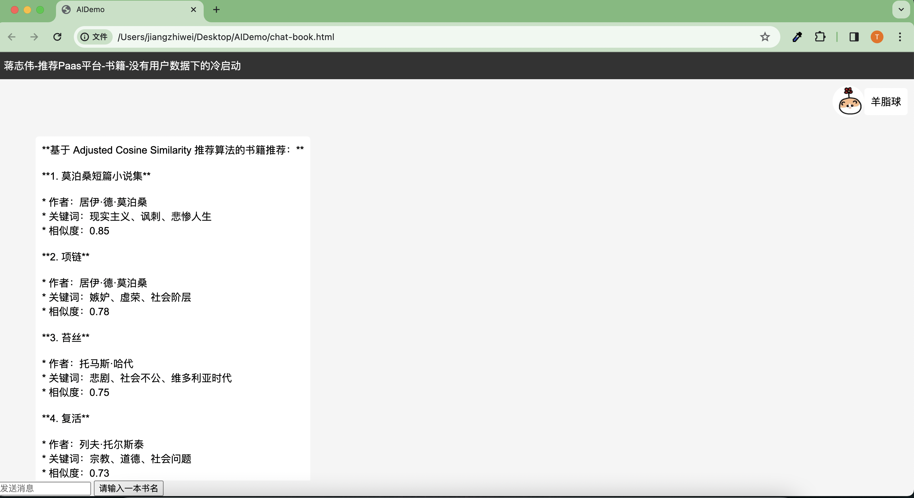
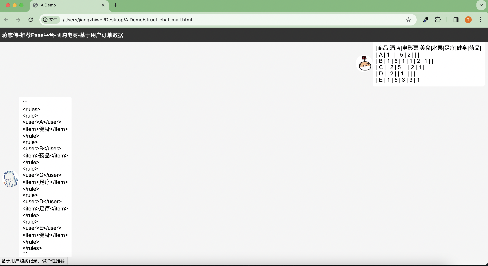

# LLMRecomand
Implementing a recommender system with LLM

## Project Description
通过访问Restful 服务访问 Gemini AI，运行开发好的AI聊天小助手
### Front-end project
进入web模块，直接访问页面
 - 推荐服务冷启动：在没有用户数据情况下，我们基于 欧几里得距离 的相识度推荐算法，
案例用户输入一个书名，推荐用户可能喜欢的书籍，效果


- 推荐服务热启动

  基于用户内容推荐:在提供用户访问数据情况下，我们基于协同过滤推荐算法.案例：给一组用户看过并且评分过的电影数据，基于用户间一些相识向量维度，推荐给所有用户没看过的电影，效果

### Java Backend API
 - Constant.java 中设置好Google Gemini API KEY
```java
    /**
     * Google Gemini AI API KEY
     * https://aistudio.google.com/app/apikey
     */
    public static final String GOOGLE_GEMINI_API_KEY = "XXXX";
    /**
     * Gemini Chat 模型下访问 API
     */
    public static final String GOOGLE_GEMINI_CHAT_URL = "https://generativelanguage.googleapis.com/v1beta/models/gemini-pro:generateContent?key="+GOOGLE_GEMINI_API_KEY;
```
### Python Backend API

