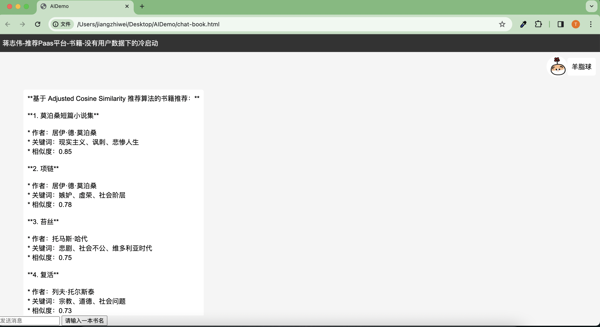
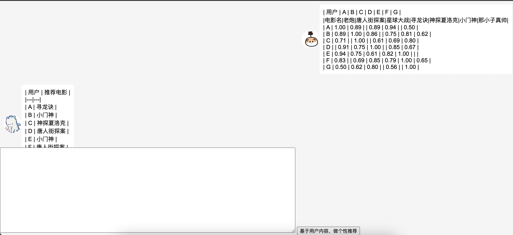
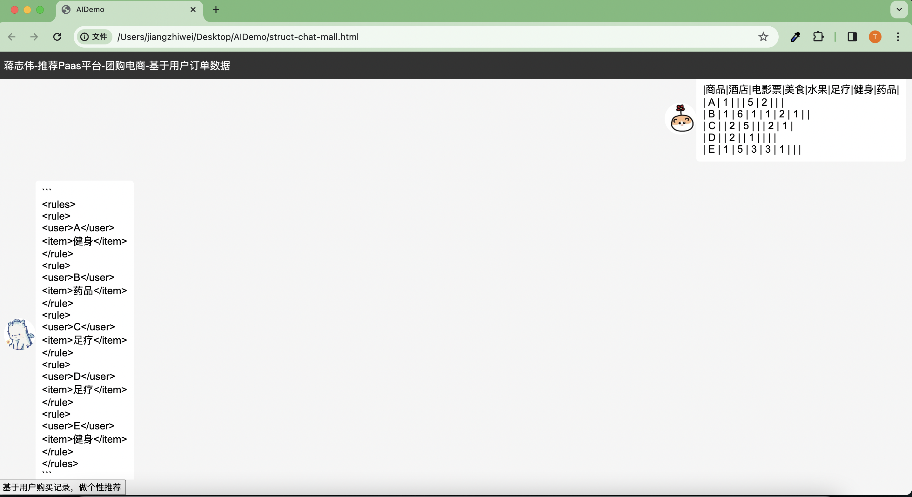

# LLMRecomand
Implementing a recommender system with LLM

## Project Description
通过访问Restful 服务访问 Gemini AI，运行开发好的AI聊天小助手
### Front-end project
进入web模块，直接访问页面
 - 推荐服务冷启动
   
   在没有用户数据情况下，我们基于 欧几里得距离 的相识度推荐算法，案例用户输入一个书名，推荐用户可能喜欢的书籍，效果
   


- 推荐服务热启动

  基于用户内容推荐:在提供用户访问数据情况下，我们基于协同过滤推荐算法.案例：给一组用户看过并且评分过的电影数据，基于用户间一些相识向量维度，推荐给所有用户没看过的电影，效果

  输入的表格案例：
```xml
| 用户 | A | B | C | D | E | F | G |
|电影名|老炮|唐人街探案|星球大战|寻龙诀|神探夏洛克|小门神|那小子真帅|
| A | 1.00 | 0.89 |          | 0.89 | 0.94 |         | 0.50 |
| B | 0.89 | 1.00 | 0.86 |         | 0.75 | 0.81 | 0.62 |
| C | 0.71  |         | 1.00 |          | 0.61 | 0.69 | 0.80 |
| D |         | 0.91 | 0.75 | 1.00 |         | 0.85 | 0.67 |
| E | 0.94 | 0.75 | 0.61 | 0.82 | 1.00 |          |          |
| F | 0.83 |          | 0.69 | 0.85 | 0.79 | 1.00 | 0.65 |
| G | 0.50 | 0.62 | 0.80 |        | 0.56 |        | 1.00 |
```


- 基于用户历史订单推荐商品
  
  在提供用户订单数据情况下，我们格式化订单和优化Prompt，基于 协同过滤 推荐算法，推荐复购率高的商品给客户。这个就是电商用得比较经典的推荐算法
  案例：假设我们有用户的购买订单表，推荐给每个用户没买过的商品，效果




### Java Backend API
 - Constant.java 中设置好Google Gemini API KEY
```java
    /**
     * Google Gemini AI API KEY
     * https://aistudio.google.com/app/apikey
     */
    public static final String GOOGLE_GEMINI_API_KEY = "XXXX";
    /**
     * Gemini Chat 模型下访问 API
     */
    public static final String GOOGLE_GEMINI_CHAT_URL = "https://generativelanguage.googleapis.com/v1beta/models/gemini-pro:generateContent?key="+GOOGLE_GEMINI_API_KEY;
```
### Python Backend API
 - Gemini 大模型更新最新的1.5，我在 demo 增加Flash1.5的演示API
 ```python
 ##此API 调用Gemini Pro-1.0
@app.post("/gemini/bookRecommendation")
async def chat(item: Item):
    book_info = gemini_pro1.book_main(item.message)
    re = ResultDto(code=200, success=True, data=book_info);
    # 打印 JSON 字符串
    print(re.__dict__)
    return re


##此API 调用Gemini 最新的 1.5 Flash
@app.post("/gemini/movieRecommendation")
async def chat(item: Item):
    movie_info = flash.movie_main(item.message)
    re = ResultDto(code=200, success=True, data=movie_info);
    # 打印 JSON 字符串
    print(re.__dict__)
    return re
 ```
  - Web API 用的是Python 的 Fastapi，不用手动启动uvicorn，直接IDE运行程序
 ```python
 if __name__ == "__main__":
    uvicorn.run("main:app", host="127.0.0.1", port=8080, log_level="info")
 ```
